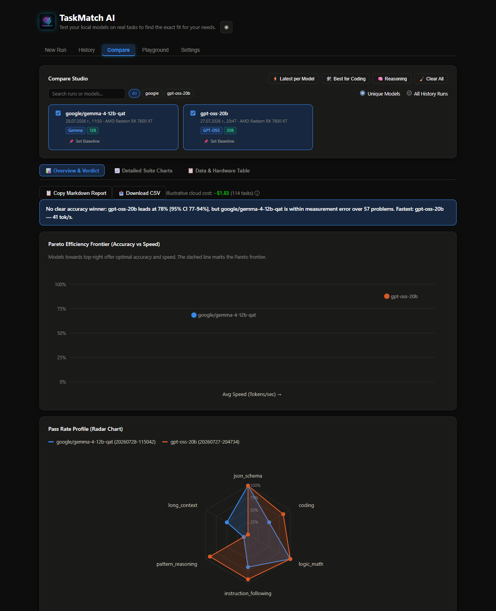

# TaskMatch AI

[](https://github.com/danielemilushev-hub/taskmatch-ai/actions/workflows/ci.yml)
[](https://www.python.org/downloads/)
[](LICENSE)

**Task-driven evaluation for local LLMs.**

A benchmarking tool for locally-running LLMs (LM Studio, Ollama, llama.cpp,
or anything else exposing an OpenAI-compatible `/v1/chat/completions`
endpoint). It exists to answer one question with real, reproducible data:
**which local model should I use for which job** — so you can route
data-sensitive or cost-sensitive work to a free local model instead of a
paid frontier one, backed by numbers instead of a guess.



## What it measures

Six fully deterministic job suites (no LLM-as-judge — every result is
exact-match, schema-validated, or actually executed):

- **json_schema** — prompts the model for structured JSON against a
  procedurally generated schema (randomised field types, enums, numeric
  ranges, regex patterns, nested objects, `additionalProperties: false`),
  validated with `jsonschema`. The schema is the ground truth and the prompt
  is generated *from* it, so the task text can never drift from what is
  actually graded.
- **coding** — procedurally generated problems (randomised operations,
  filters, thresholds, orderings); the model's code is *actually executed* in
  a sandboxed subprocess against real test cases, not compared as text.
  Expected answers come from running a reference implementation, never
  hand-written. Deliberately avoids the classic factorial/fibonacci/is_prime
  set, which is in every training corpus and can be passed from memory.
- **logic_math** — synthetically generated arithmetic/logic problems (we
  generate them, so the answer is always known), graded by exact match.
- **instruction_following** — IFEval-style formatting constraints (exact
  paragraph count, forbidden letters, exact ending phrase, word limits,
  etc.) graded by mechanical rule-checking, never an LLM judge.
- **pattern_reasoning** — ARC-AGI-style abstract grid-transformation
  puzzles, synthetically generated, graded by exact grid match.
- **long_context** — a large (1000+ line) source excerpt with either a
  planted "needle" value to retrieve or a mechanically-injected bug to
  locate by line number; can use a real file on your machine or a bundled
  synthetic fallback.

Every run also captures: total latency, time-to-first-token (TTFT, measured
via streaming — separates prefill/"thinking" time from raw decode speed),
tokens/sec, a hardware snapshot (CPU/RAM/GPU — best-effort, vendor-generic),
and peak CPU/RAM/VRAM usage sampled during generation relative to a
pre-run baseline (a useful signal for whether a model spilled out of VRAM
into CPU/RAM — see Known Limitations for the VRAM caveat). A failed problem
is tagged distinctly rather than lumped in with a plain wrong answer:
`truncated` when it hit the token budget mid-thought, or `loop_detected`
when generation was aborted early because the model got stuck re-deriving
the same content instead of converging. A model can also pass but be
flagged `early_exit` — it found a correct, verified answer but never
stopped talking on its own, a real practical weakness worth knowing about
separately from raw correctness. See Config notes below for how each of
these is detected.

**Five of the six suites generate their problems from a seed**, so the exact
tasks cannot have appeared in any training corpus — the contamination that
undermines most static public benchmarks. Every pass rate is reported with a
95% confidence interval, and the head-to-head verdict refuses to name a
winner when the intervals overlap, rather than presenting measurement noise
as a result.

A seventh, opt-in **frontier_graded** suite exists for open-ended tasks that
can't be graded deterministically (see below) — it's never mixed into the
six deterministic suites' scoring.

## Install

Requires **Python 3.11+** and a local runtime already serving an
OpenAI-compatible API (LM Studio, Ollama, llama.cpp, vLLM...).

```bash
git clone https://github.com/danielemilushev-hub/taskmatch-ai
cd taskmatch-ai
pip install -r requirements.txt
python cli.py serve
```

That's it — the dashboard opens at `http://localhost:8000`. On first run
`config.yaml` is created for you from `config.example.yaml`, and everything
else (runtime URL, which models, which suites) is set from the **Settings**
and **New Run** tabs. No file editing required to get going.

<details>
<summary>Prefer a virtualenv (recommended)</summary>

```bash
python -m venv .venv
source .venv/bin/activate        # Windows: .venv\Scripts\activate
pip install -r requirements.txt
python cli.py serve
```
</details>

`config.yaml` is **gitignored on purpose** — it holds your runtime URL, model
list, judge choice and (optionally) a real path from your disk. Only
`config.example.yaml` is tracked, so your working config can never be pushed
by accident.

## Platform support

| | Benchmarks & dashboard | GPU memory / utilization |
|---|---|---|
| **Windows** | full | any vendor — AMD, Intel, NVIDIA (via OS GPU counters) |
| **Linux** | full | NVIDIA only (`nvidia-smi`) |
| **macOS** | full | not available |

Every suite, the scoring, the reports and the whole dashboard are pure Python
and work identically everywhere. Only *GPU* telemetry is platform-dependent:
where no probe works it is reported as `not captured` rather than guessed, and
CPU/RAM/disk monitoring works on all three. Nothing crashes or degrades
silently — verified by running the hardware and GPU probes under simulated
Linux and macOS.

Models are benchmarked **strictly sequentially** — one fully loaded and
tested before the next is loaded — because these are large models on
limited VRAM. If a model has no `switch.load_cmd`, the tool pauses and
waits for you to load it manually (works for any runtime, not just LM
Studio).

## Running

```bash
python cli.py run --job all                 # every suite, every model in config.yaml
python cli.py run --job coding               # just one suite
python cli.py run --job all --model NAME     # just one model from config.yaml
```

Each run writes:
- `results/runs/<timestamp>.json` — the full, self-contained result (share
  this file directly to compare with someone else).
- `results/<timestamp>.md` — a markdown leaderboard rendered from it.

### Web dashboard

```bash
python cli.py serve   # http://localhost:8000 by default; --port to change
```

FastAPI backend + a plain HTML/CSS/JS frontend, no build step. Five tabs:

- **New Run** — pick models (including live-detected ones straight from the
  runtime, complete with real size/quantization/context-length/vision/
  tool-use badges pulled from LM Studio's own catalog when available) and
  suites, start a run, and watch:
  - a live-scrolling log with per-problem `[i/N] problem_id: PASS/FAIL`
    lines as each one finishes, not just a static "running suite..." line
  - a **live hardware monitor** — CPU%, RAM (used/total), GPU utilization
    %, GPU memory, and disk read/write throughput, sampled roughly every
    second for the duration of the run (see Known Limitations for exactly
    how GPU data is obtained and its refresh cadence)
  - the manual-switch confirm banner, if a model has no `load_cmd`
  - an optional **Frontier Judge** panel (see below) with a live
    provider/model picker, task/call-count breakdown, and a duration/cost
    estimate drawn from your own prior runs with that judge
- **History** — every saved run, filterable by suite/model, with delete,
  and one-click Markdown/PDF/raw-JSON downloads. Suite pass-rate pills show
  a truncation-count badge when some failures hit the token budget rather
  than answering incorrectly.
- **Compare** — pick any combination of past runs/models and get: a
  Pareto-frontier scatter (accuracy vs. speed), a per-suite radar chart, bar
  charts (pass rate, tokens/sec, TTFT), a full sortable/filterable table
  with a click-through problem inspector (prompt/response/reasoning/error,
  and judge score+rationale for the frontier suite), and Markdown/CSV
  export. A separate **Frontier Judge** section appears when any compared
  run used it, kept apart from the deterministic charts above.
- **Playground** — run an arbitrary one-off prompt (optionally with a JSON
  schema to validate against) against any detected model, outside of any
  saved benchmark run.
- **Settings** — runtime base URL (with LM Studio/Ollama/llama.cpp presets
  and a live connection test), frontier judge provider/model/task-count/
  pass-threshold, and a per-provider API key manager (stored in a local,
  gitignored `.env`; keys are never echoed back once saved).

## Run profiles

Two sizes, chosen on the New Run tab:

| | Problems | A 90% score gives a 95% CI of |
|---|---|---|
| **Quick baseline** | 57 | 79–95% |
| **Full benchmark** | 114 | 84–95% |

Quick is the **first half of each suite, not a random sample**. Every
generator emits problems in a deterministic order from its seed, so a quick
run's problems are a strict prefix of the full run's — the two are directly
comparable, quick just measures fewer of the same tasks and carries a wider
interval. Use Quick to iterate (does this quantization help?) and Full when
you want to separate close models.

Each run records which profile it used, so a Quick and a Full run are never
silently treated as equivalent.

## Frontier judge (opt-in, paid)

For tasks that genuinely can't be graded deterministically (instruction-
following quality, summarization faithfulness, creative writing, etc.), a
frontier model (Anthropic/OpenAI/Gemini/OpenRouter) can generate tasks and
grade the local model's responses per the rubric in
[TASK_SPEC.md](TASK_SPEC.md) — including a dedicated anti-hallucination
rule: the judge is never asked to recall real-world facts from memory as
ground truth, only to evaluate against self-contained or
harness-verifiable content. This never runs by accident, from either
interface:

**CLI:**
1. Copy `.env.example` to `.env` and fill in the key for your chosen
   provider only.
2. Set `judge.enabled: true` in `config.yaml` and pick a `provider`/`model`.
3. Run `python cli.py run --job frontier_graded` — this prints exactly how
   many paid API calls it will make and requires a `y` confirmation before
   spending anything.

**Dashboard:** enable the judge and add a key in Settings, then check
"Include frontier-graded suite" on the New Run tab — a provider/model
picker (with live model lists fetched from each provider's own API, or
OpenRouter's public catalog) and an explicit paid-cost confirmation dialog
appear before it runs. Duration and cost estimates are shown when available
from a previous run with that exact judge:
- **Duration** is estimated from real wall-clock time observed last time
  (local call + both paid judge calls), for any provider.
- **Cost** is a real dollar estimate only for **OpenRouter** — it publishes
  live, public, per-token pricing, which is combined with real token usage
  from your last run. Anthropic/OpenAI/Gemini don't expose pricing via a
  stable public API, so their estimate is deliberately left as "check your
  provider's pricing page" rather than a hardcoded number that would go
  stale.

Reports always show this suite in a visually distinct "Frontier-Graded
(non-deterministic, paid)" section, never mixed into the six suites'
pass-rate numbers.

Only install the SDK for the provider you're actually using (see
`requirements.txt`) — each is imported lazily, so the rest of the app
works with none of them installed. `openrouter` reuses the `openai`
package pointed at OpenRouter's endpoint, so it needs no separate SDK.

## Config notes

- **Per-suite `max_tokens`/`call_timeout_seconds` overrides**: reasoning
  models can spend a large, variable number of hidden "thinking" tokens
  before writing an answer. If the budget/timeout is too low, a response
  gets cut off mid-thought — the harness reports this distinctly as
  `truncated`, never silently as "wrong answer." The shipped defaults are
  tiered on live evidence: every legitimate (non-looping) answer observed
  finished under ~3,200 tokens, but two suites showed genuine, correct,
  non-repetitive reasoning running past that (one confirmed pass needed
  6,466) — so the simple suites get 4096 and coding/pattern_reasoning get
  6144. Raising the cap costs nothing for a fast-converging answer (it's a
  ceiling, not a wait — generation ends the instant the model stops on its
  own); it only bounds how long a *stalled* generation runs before giving up.
- **`detect_loops`** (per suite): some reasoning models get stuck
  re-deriving the same content instead of converging — a live transcript
  showed 20,000 completion tokens (2.4x a suite's normal cap) ending in
  `finish_reason=length` with zero characters of actual answer, all of it
  spent re-checking the same examples on repeat. This watches the streamed
  response for that pattern and aborts early instead of waiting out
  `max_tokens`, reporting it distinctly as `loop_detected` rather than a
  plain wrong answer or truncation.
- **`early_exit_check`** (coding suite): a related but different failure —
  a live transcript showed the model finding fully correct code within the
  first few hundred tokens, then never stopping, re-verifying it against
  new self-invented test cases indefinitely. This actually runs the
  candidate code against the real tests as it streams in, and grades a
  pass the moment a correct answer exists, rather than penalizing a model
  for failing to terminate. Reported as `early_exit` (passed, but the model
  didn't stop on its own) — a real practical weakness worth surfacing
  separately from raw correctness.
- **`long_context.source_file`**: optional path to a real file on your
  machine for a more realistic excerpt than the bundled synthetic
  generator. Left `null` by default — if you set a real path, that path
  will be visible to anyone you share `config.yaml` with (including a git
  remote), so consider keeping that particular edit local/uncommitted.

## Known limitations

- **Sandbox isolation**: the `coding` suite runs generated code in its own
  subprocess with a hard timeout, in a throwaway temp directory — not full
  OS-level sandboxing (no seccomp/cgroups/chroot). That's the practical
  ceiling on Windows without extra tooling; don't run this against
  untrusted models you don't want executing arbitrary code on your machine.
- **VRAM/GPU-utilization sampling (`localbench/gpu_probe.py`) tries three
  probes in order, with uneven verification:**
  - `nvidia-smi` — NVIDIA, and genuinely cross-platform (ships with the
    driver on Linux too, not just Windows). Live-tested this session.
  - Windows GPU performance counters via CIM — the same counters Task
    Manager's GPU tab reads; works for *any* vendor (AMD/Intel/NVIDIA) but
    only on Windows. Live-tested this session (this machine's own AMD GPU).
  - `rocm-smi` / `amd-smi` — AMD on Linux. **Written defensively but not
    verified against real ROCm hardware** — no ROCm machine was available
    to confirm the exact JSON key names this parses actually match a real
    installation. It degrades to "unavailable" rather than crashing or
    guessing if the shape doesn't match, but treat a `rocm-smi`/`amd-smi`
    reading as plausible, not confirmed, until checked on real hardware.
  - If none of these work (macOS, or Linux with neither NVIDIA nor ROCm),
    GPU usage is honestly reported as unavailable, never guessed. Static
    hardware-snapshot VRAM *size* (not live usage) additionally falls back
    to a Windows registry read when `nvidia-smi` isn't present.
  - None of the supported runtimes expose an exact GPU-vs-CPU offload
    ratio via their API/CLI regardless of source — if tokens/sec looks
    much lower than expected for a model's size, check the runtime's own
    UI (e.g. LM Studio's Developer tab) to confirm.
- **`lms load` can stack duplicate model instances** instead of reusing an
  already-loaded one — `runtime.unload_all_cmd` exists specifically to
  guarantee a clean slate before every switch.
- **macOS**: CPU/RAM figures use `psutil` and work anywhere, but there is
  currently no GPU probe at all on macOS. Apple Silicon's unified memory
  architecture also means "VRAM" isn't a separate quantity the way it is on
  a discrete GPU, so even a future probe would report something
  conceptually different (e.g. swap pressure) rather than a directly
  comparable VRAM-used figure.

## Project layout

```
config.yaml               # your runtime/model/suite/judge configuration
.env.example               # documents the 4 judge API key names (.env is gitignored)
TASK_SPEC.md                # the frontier judge's task-generation/grading rubric
cli.py                       # entry point (run / serve)
localbench/                # Python package name kept as-is (see note below)
  engine.py                   # runtime-agnostic streaming chat_completion() caller
  runner.py                   # sequential model-switch orchestration + per-problem progress
  report.py                   # markdown/HTML/PDF report rendering
  storage.py                  # save/list/load/delete run records
  settings_store.py           # dashboard Settings: config.yaml edits + .env key management
  live_monitor.py             # continuous CPU/RAM/GPU/disk sampling during a run (real-time only)
  hardware.py                 # one-time CPU/RAM/GPU snapshot per run
  resource_monitor.py         # per-suite baseline->peak CPU/RAM/VRAM delta (saved to the report)
  results.py                  # ProblemResult / SuiteRunResult / RunRecord
  suites/                      # one module per job suite
  data/                        # problem generators/data for each suite
  judge/                        # frontier judge provider clients + factory
webapp/
  main.py                       # FastAPI backend for the dashboard
  run_manager.py                 # background run threads + live status/progress
  static/                         # HTML/CSS/JS frontend, no build step
results/runs/                     # one JSON file per benchmark run (gitignored)
```

## Documentation

| Document | Contents |
|---|---|
| [SECURITY.md](SECURITY.md) | What data leaves your machine (and what doesn't), how API keys are stored, and the code-execution risk in the `coding` suite. **Read before benchmarking a model you don't trust.** |
| [CONTRIBUTING.md](CONTRIBUTING.md) | Dev setup, tests, how to add a job suite, and the project's core rule on never displaying an unmeasured number. |
| [TASK_SPEC.md](TASK_SPEC.md) | The rubric the frontier judge is given, including the anti-hallucination contract. |

## License

[Apache License 2.0](LICENSE).
